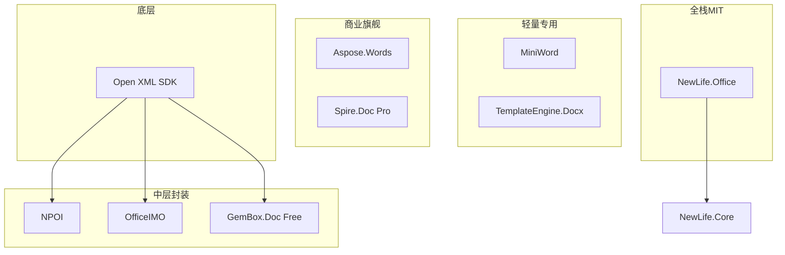

# Word 竞品分析

← 返回 [竞品分析报告.md](竞品分析报告.md)

---

## 1. 概述

本报告针对 .NET 生态中 Word 文档操作的主流开源/商业库，从**功能覆盖度、高保真读写、API 易用性、性能、体积、许可证、框架兼容性**七个维度进行深度对比，为 NewLife.Office Word 模块的功能规划与差异化定位提供依据。

### 1.1 竞品全景

| 库名 | 许可证 | 最新版本 | 包体积 | 支持格式 | Stars | 下载量 |
|------|--------|---------|--------|---------|-------|--------|
| **Open XML SDK** | MIT | 3.x | ~2MB | docx/xlsx/pptx | ~4k | 3000万+ |
| **NPOI** | Apache 2.0 | 2.7.x | ~10MB | doc/docx/xls/xlsx/ppt/pptx | ~5k | 5000万+ |
| **MiniWord** | Apache 2.0 | 0.9.x | <500KB | docx（仅模板写入） | ~600+ | 50万+ |
| **OfficeIMO** | MIT | 0.17.x | ~1MB | docx | ~300+ | 10万+ |
| **TemplateEngine.Docx** | MIT | 1.x | <1MB | docx（仅模板） | ~200+ | 20万+ |
| **GemBox.Document** | 免费受限/商业 | 3.7.x | ~5MB | docx/pdf/html/rtf | N/A | 100万+ |
| **Aspose.Words** | 商业 | 25.x | ~40MB | doc/docx/rtf/html/pdf 等 | N/A | 1000万+ |
| **Spire.Doc** | 免费受限/商业 | 12.x | ~15MB | doc/docx/pdf/html/rtf | N/A | 200万+ |
| **NewLife.Office** | MIT | — | <500KB | docx/doc | — | — |

### 1.2 竞品分层定位



> **NewLife.Office 定位**：MIT 许可下功能最全面的 Word 文档库，以文档模型（`WordDocument`）为核心，实现 docx 高保真读写往返，覆盖从程序化创建、模板填充到格式转换的完整链路。唯一在 MIT 许可下同时支持 docx 读写模型 + doc 读取 + 模板 + 转换的开源方案。

---

## 2. 功能对比矩阵（71 项）

### 2.1 基础读写能力

| 编号 | 功能 | NewLife.Office | Open XML SDK | NPOI | MiniWord | OfficeIMO | Aspose.Words | GemBox |
|------|------|:---:|:---:|:---:|:---:|:---:|:---:|:---:|
| F01 | 读取 docx 文本 | ✅ | ✅ | ✅ | ❌ | ✅ | ✅ | ✅ |
| F02 | 写入/创建 docx | ✅ | ✅ | ✅ | ✅ | ✅ | ✅ | ✅ |
| F03 | 读取 doc（97-2003） | ✅ | ❌ | ✅ | ❌ | ❌ | ✅ | ✅ |
| F04 | 写入 doc | ❌ | ❌ | ✅ | ❌ | ❌ | ✅ | ✅ |
| F05 | 文档模型（对象模型读写） | ✅ | ❌ | 部分 | ❌ | ✅ | ✅ | ✅ |
| F06 | 流式读取（低内存） | ✅ | ❌ | ❌ | ❌ | ❌ | ✅ | 部分 |
| F07 | RawXml 透传保真 | ✅ | ✅ | 部分 | ❌ | ❌ | ✅ | ✅ |
| F08 | ZIP 部件完整透传 | ✅ | ❌ | ❌ | ❌ | ❌ | ✅ | ✅ |

### 2.2 段落与文本格式

| 编号 | 功能 | NewLife.Office | Open XML SDK | NPOI | MiniWord | OfficeIMO | Aspose.Words | GemBox |
|------|------|:---:|:---:|:---:|:---:|:---:|:---:|:---:|
| F09 | 粗体/斜体 | ✅ | ✅ | ✅ | ✅ | ✅ | ✅ | ✅ |
| F10 | 下划线（含样式） | ✅ | ✅ | ✅ | ✅ | ✅ | ✅ | ✅ |
| F11 | 删除线 | ✅ RawXml | ✅ | ✅ | ❌ | ✅ | ✅ | ✅ |
| F12 | 上标/下标 | ✅ RawXml | ✅ | ✅ | ❌ | ✅ | ✅ | ✅ |
| F13 | 字体名称/大小 | ✅ | ✅ | ✅ | 部分 | ✅ | ✅ | ✅ |
| F14 | 字体颜色 | ✅ | ✅ | ✅ | ✅ | ✅ | ✅ | ✅ |
| F15 | 高亮（文字背景） | ✅ RawXml | ✅ | ✅ | ❌ | ✅ | ✅ | ✅ |
| F16 | 字符间距/缩放 | ✅ RawXml | ✅ | 部分 | ❌ | 部分 | ✅ | ✅ |
| F17 | 首字下沉 | ✅ | ✅ | ❌ | ❌ | ❌ | ✅ | ✅ |
| F18 | 文字效果（发光/阴影/反射） | ✅ 发光/阴影 | ✅ | ❌ | ❌ | ❌ | ✅ | 部分 |
| F19 | 多 Run 富文本段落 | ✅ | ✅ | ✅ | 部分 | ✅ | ✅ | ✅ |
| F20 | 段落内嵌图片 | ✅ RawXml | ✅ | 部分 | ✅ | 部分 | ✅ | ✅ |

### 2.3 段落与排版

| 编号 | 功能 | NewLife.Office | Open XML SDK | NPOI | MiniWord | OfficeIMO | Aspose.Words | GemBox |
|------|------|:---:|:---:|:---:|:---:|:---:|:---:|:---:|
| F21 | 标题 1-6 | ✅ | ✅ | ✅ | ❌ | ✅ | ✅ | ✅ |
| F22 | 段落对齐（左/中/右/两端） | ✅ | ✅ | ✅ | ✅ | ✅ | ✅ | ✅ |
| F23 | 段落缩进（左/右/首行/悬挂） | ✅ | ✅ | ✅ | ❌ | ✅ | ✅ | ✅ |
| F24 | 段前/段后间距 | ✅ | ✅ | ✅ | ❌ | ✅ | ✅ | ✅ |
| F25 | 行距（单倍/1.5/双倍/固定值） | ✅ | ✅ | ✅ | ❌ | ✅ | ✅ | ✅ |
| F26 | 段落边框 | ✅ RawXml | ✅ | 部分 | ❌ | 部分 | ✅ | ✅ |
| F27 | 段落底纹/背景色 | ✅ | ✅ | 部分 | ❌ | 部分 | ✅ | ✅ |
| F28 | 制表位（Tab Stop） | ✅ | ✅ | 部分 | ❌ | ✅ | ✅ | ✅ |
| F29 | 分页符 | ✅ | ✅ | ✅ | ❌ | ✅ | ✅ | ✅ |
| F30 | 分节符（页面/连续/奇偶页） | ✅ RawXml | ✅ | ✅ | ❌ | ✅ | ✅ | ✅ |
| F31 | 分栏 | ✅ | ✅ | 部分 | ❌ | 部分 | ✅ | ✅ |
| F32 | 行号 | ✅ | ✅ | ❌ | ❌ | ✅ | ✅ | ✅ |
| F33 | 段落大纲级别 | ✅ RawXml | ✅ | 部分 | ❌ | ✅ | ✅ | ✅ |

### 2.4 列表

| 编号 | 功能 | NewLife.Office | Open XML SDK | NPOI | MiniWord | OfficeIMO | Aspose.Words | GemBox |
|------|------|:---:|:---:|:---:|:---:|:---:|:---:|:---:|
| F34 | 无序列表（项目符号） | ✅ | ✅ | ✅ | ✅ | ✅ | ✅ | ✅ |
| F35 | 有序列表（编号） | ✅ | ✅ | ✅ | ❌ | ✅ | ✅ | ✅ |
| F36 | 多级嵌套列表 | 部分 | ✅ | 部分 | ❌ | ✅ | ✅ | ✅ |
| F37 | 自定义项目符号/编号格式 | 部分 | ✅ | 部分 | ❌ | 部分 | ✅ | ✅ |
| F38 | 列表续号 | ✅ | ✅ | ❌ | ❌ | 部分 | ✅ | ✅ |

### 2.5 表格

| 编号 | 功能 | NewLife.Office | Open XML SDK | NPOI | MiniWord | OfficeIMO | Aspose.Words | GemBox |
|------|------|:---:|:---:|:---:|:---:|:---:|:---:|:---:|
| F39 | 创建表格 | ✅ | ✅ | ✅ | ✅ | ✅ | ✅ | ✅ |
| F40 | 读取表格 | ✅ | ✅ | ✅ | ❌ | ✅ | ✅ | ✅ |
| F41 | 单元格合并（横向/纵向） | ✅ | ✅ | ✅ | 部分 | ✅ | ✅ | ✅ |
| F42 | 表格边框样式 | ✅ | ✅ | ✅ | 部分 | ✅ | ✅ | ✅ |
| F43 | 单元格背景色 | ✅ | ✅ | ✅ | ❌ | ✅ | ✅ | ✅ |
| F44 | 表头行样式 | ✅ | ✅ | ✅ | ❌ | ✅ | ✅ | ✅ |
| F45 | 斑马纹（交替行色） | ✅ | ✅ | 部分 | ❌ | ❌ | ✅ | ✅ |
| F46 | 列宽精确控制 | ✅ | ✅ | ✅ | ❌ | ✅ | ✅ | ✅ |
| F47 | 表格对齐/缩进 | ✅ | ✅ | 部分 | ❌ | ✅ | ✅ | ✅ |
| F48 | 单元格内多段落 | ✅ | ✅ | ✅ | ❌ | ✅ | ✅ | ✅ |
| F49 | 嵌套表格 | ✅ RawXml | ✅ | 部分 | ❌ | 部分 | ✅ | ✅ |
| F50 | 跨页标题行重复 | ✅ | ✅ | 部分 | ❌ | ✅ | ✅ | ✅ |

### 2.6 图片与绘图

| 编号 | 功能 | NewLife.Office | Open XML SDK | NPOI | MiniWord | OfficeIMO | Aspose.Words | GemBox |
|------|------|:---:|:---:|:---:|:---:|:---:|:---:|:---:|
| F51 | 插入图片（PNG/JPEG） | ✅ | ✅ | ✅ | ✅ | ✅ | ✅ | ✅ |
| F52 | 图片尺寸/位置控制 | ✅ | ✅ | ✅ | 部分 | ✅ | ✅ | ✅ |
| F53 | 图片环绕方式（嵌入/四周/紧密） | ✅ RawXml | ✅ | 部分 | ❌ | 部分 | ✅ | ✅ |
| F54 | SVG 图片 | ✅ 透传 | 部分 | ❌ | ❌ | ❌ | ✅ | ✅ |
| F55 | 文本框/形状 | ✅ RawXml | ✅ | 部分 | ❌ | 部分 | ✅ | ✅ |
| F56 | 自选图形（线条/矩形/圆等） | ❌ | ✅ | 部分 | ❌ | 部分 | ✅ | ✅ |

### 2.7 页面与布局

| 编号 | 功能 | NewLife.Office | Open XML SDK | NPOI | MiniWord | OfficeIMO | Aspose.Words | GemBox |
|------|------|:---:|:---:|:---:|:---:|:---:|:---:|:---:|
| F57 | 页面尺寸/方向 | ✅ | ✅ | ✅ | ❌ | ✅ | ✅ | ✅ |
| F58 | 页边距 | ✅ | ✅ | ✅ | ❌ | ✅ | ✅ | ✅ |
| F59 | 页眉（文本/富文本） | ✅ | ✅ | ✅ | ❌ | ✅ | ✅ | ✅ |
| F60 | 页脚（文本/富文本/页码） | ✅ | ✅ | ✅ | ❌ | ✅ | ✅ | ✅ |
| F61 | 奇偶页不同页眉页脚 | ✅ RawXml | ✅ | 部分 | ❌ | ✅ | ✅ | ✅ |
| F62 | 首页不同页眉页脚 | ✅ RawXml | ✅ | 部分 | ❌ | ✅ | ✅ | ✅ |
| F63 | 多节不同页面设置 | ✅ RawXml | ✅ | 部分 | ❌ | ✅ | ✅ | ✅ |
| F64 | 水印（文字/图片） | ✅ 文字 | ✅ | 部分 | ❌ | ✅ | ✅ | ✅ |
| F65 | 页面边框 | ✅ | ✅ | ❌ | ❌ | ✅ | ✅ | ✅ |

### 2.8 导航与引用

| 编号 | 功能 | NewLife.Office | Open XML SDK | NPOI | MiniWord | OfficeIMO | Aspose.Words | GemBox |
|------|------|:---:|:---:|:---:|:---:|:---:|:---:|:---:|
| F66 | 超链接（URL/邮箱） | ✅ | ✅ | ✅ | ✅ | ✅ | ✅ | ✅ |
| F67 | 书签 | ✅ | ✅ | 部分 | ❌ | ✅ | ✅ | ✅ |
| F68 | 内部交叉引用 | ✅ | ✅ | ❌ | ❌ | 部分 | ✅ | ✅ |
| F69 | 目录（TOC 域） | ✅ RawXml | ✅ | 部分 | ❌ | ✅ | ✅ | ✅ |
| F70 | 脚注 | ✅ RawXml | ✅ | 部分 | ❌ | ✅ | ✅ | ✅ |
| F71 | 尾注 | ✅ RawXml | ✅ | 部分 | ❌ | ✅ | ✅ | ✅ |

### 2.9 文档属性与保护

| 编号 | 功能 | NewLife.Office | Open XML SDK | NPOI | MiniWord | OfficeIMO | Aspose.Words | GemBox |
|------|------|:---:|:---:|:---:|:---:|:---:|:---:|:---:|
| F72 | 文档属性（标题/作者/主题） | ✅ | ✅ | ✅ | ❌ | ✅ | ✅ | ✅ |
| F73 | 自定义属性 | ✅ | ✅ | 部分 | ❌ | ✅ | ✅ | ✅ |
| F74 | 文档保护（只读/密码） | ✅ | ✅ | 部分 | ❌ | ✅ | ✅ | ✅ |
| F75 | 修订追踪（Track Changes） | ❌ | ✅ | ❌ | ❌ | 部分 | ✅ | ✅ |
| F76 | 文档加密（AES） | ❌ | ✅ | 部分 | ❌ | ✅ | ✅ | ✅ |

### 2.10 高级内容

| 编号 | 功能 | NewLife.Office | Open XML SDK | NPOI | MiniWord | OfficeIMO | Aspose.Words | GemBox |
|------|------|:---:|:---:|:---:|:---:|:---:|:---:|:---:|
| F77 | 批注（Comment） | ✅ 读/存 | ✅ | 部分 | ❌ | 部分 | ✅ | ✅ |
| F78 | 域代码（Field） | ✅ RawXml | ✅ | 部分 | ❌ | 部分 | ✅ | ✅ |
| F79 | 内容控件 | ✅ | ✅ | ❌ | ❌ | 部分 | ✅ | ✅ |
| F80 | 公式（MathML/OMML） | ✅ 透传 | ✅ | ❌ | ❌ | ❌ | ✅ | ✅ |
| F81 | 图表（Chart） | ✅ 透传 | ✅ | ❌ | ❌ | 部分 | ✅ | ✅ |
| F82 | 嵌入对象（OLE） | ✅ 透传 | ✅ | 部分 | ❌ | ❌ | ✅ | ✅ |
| F83 | ActiveX 控件 | ❌ | ✅ | ❌ | ❌ | ❌ | ✅ | 部分 |
| F84 | 自定义 XML 部件 | ✅ | ✅ | ❌ | ❌ | ❌ | ✅ | ✅ |
| F85 | SmartArt | ✅ 透传 | ✅ | ❌ | ❌ | ❌ | ✅ | 部分 |

### 2.11 模板与数据绑定

| 编号 | 功能 | NewLife.Office | Open XML SDK | NPOI | MiniWord | OfficeIMO | Aspose.Words | GemBox |
|------|------|:---:|:---:|:---:|:---:|:---:|:---:|:---:|
| F86 | 占位符替换 `{{Key}}` | ✅ | ❌ | ❌ | ✅ | ❌ | ✅ | ✅ |
| F87 | 表格区域循环填充 | ✅ | ❌ | ❌ | ✅ | ❌ | ✅ | ✅ |
| F88 | 图片占位符替换 | ✅ | ❌ | ❌ | ✅ | ❌ | ✅ | ✅ |
| F89 | 嵌套 XML 拆分占位符合并 | ✅ | ❌ | ❌ | ❌ | ❌ | ✅ | ❌ |
| F90 | 对象集合→Word 表格 | ✅ | ❌ | ❌ | ❌ | ❌ | ✅ | ✅ |
| F91 | Mail Merge（域合并） | ⚠️（域代码已生成，无执行引擎） | ❌ | ❌ | ❌ | ❌ | ✅ | ✅ |

### 2.12 格式转换

| 编号 | 功能 | NewLife.Office | Open XML SDK | NPOI | MiniWord | OfficeIMO | Aspose.Words | GemBox |
|------|------|:---:|:---:|:---:|:---:|:---:|:---:|:---:|
| F92 | Word → PDF | ✅ 内容映射 | ❌ | ❌ | ❌ | ❌ | ✅ 高保真 | ✅ Pro |
| F93 | Word → HTML | ✅ 语义化 | ❌ | ❌ | ❌ | ❌ | ✅ | ✅ Pro |
| F94 | Word → Markdown | ✅ | ❌ | ❌ | ❌ | ❌ | ✅ | ❌ |
| F95 | Word → 图片 | ❌ 规划 | ❌ | ❌ | ❌ | ❌ | ✅ | ✅ Pro |
| F96 | Markdown → Word | ✅ | ❌ | ❌ | ❌ | ❌ | ✅ | ❌ |

---

## 3. 高保真读写能力对比

### 3.1 保真策略分级

| 级别 | 策略 | 代表库 | 说明 |
|------|------|--------|------|
| **L1 语义级** | 仅提取文本内容 | MiniWord | 忽略所有格式，只保留文字 |
| **L2 模型级** | 构建对象模型，覆盖主要属性 | NPOI、OfficeIMO | 模型覆盖 60-80% 常用属性 |
| **L3 透传级** | 模型 + RawXml 兜底 | **NewLife.Office**、GemBox | 已建模属性走模型，未建模透传原始 XML |
| **L4 引擎级** | 完整 DOM + 渲染引擎 | Aspose.Words | 商业级完整实现，理解全部 OOXML 语义 |

### 3.2 NewLife.Office 保真架构

```
docx 文件
    ↓ WordReader.ReadDocument()
WordDocument (模型)
    ├── Elements[]          程序化访问（段落/表格/图片）
    │   ├── WordParagraph   StyleId + Alignment + Indent + Spacing + Runs
    │   ├── WordTable       完整表格模型
    │   └── RawXml          每个元素保留原始 XML ★
    ├── Images[]             图片二进制
    ├── Hyperlinks[]         超链接关系
    ├── Headers[]            富文本页眉
    ├── Footers[]            富文本页脚
    ├── Comments[]           批注
    ├── StylesXml            样式表原始 XML ★
    ├── NumberingXml         编号定义原始 XML ★
    ├── SettingsXml          文档设置原始 XML ★
    ├── SectPrXml            节属性原始 XML ★
    ├── DocumentXmlNsDecls   命名空间声明 ★
    └── OtherParts[]         所有非 document.xml 部件 ★
    ↓ WordWriter.Save(doc)
docx 文件（视觉保真）
```

> **★ 标记的字段**是保真的关键——Reader 原样捕获，Writer 优先使用它们而非重新生成。这使得 NewLife.Office 在修改已有 docx 时能达到 L3 级保真。

### 3.3 往返保真测试场景

| 测试场景 | NewLife.Office | NPOI | Open XML SDK | Aspose.Words |
|----------|:---:|:---:|:---:|:---:|
| 纯文本段落往返 | ✅ 无损 | ✅ 无损 | ✅ 无损 | ✅ 无损 |
| 多字体/颜色混排 | ✅ RawXml 保真 | 部分损失 | ✅ 无损 | ✅ 无损 |
| 复杂表格（合并单元格/边框） | ✅ RawXml 保真 | 部分损失 | ✅ 无损 | ✅ 无损 |
| 段落边框/底纹 | ✅ RawXml 保真 | 部分损失 | ✅ 无损 | ✅ 无损 |
| 页眉页脚（多类型） | ✅ RawXml 保真 | 部分损失 | ✅ 无损 | ✅ 无损 |
| 多节不同页面设置 | ✅ RawXml 保真 | 部分损失 | ✅ 无损 | ✅ 无损 |
| 脚注/尾注 | ✅ RawXml 保真 | 部分损失 | ✅ 无损 | ✅ 无损 |
| 目录（TOC） | ✅ RawXml 保真 | 部分损失 | ✅ 无损 | ✅ 无损 |
| 内嵌公式（OMML） | ✅ 透传 | ❌ 丢失 | ✅ 无损 | ✅ 无损 |
| 内嵌图表 | ✅ 透传 | ❌ 丢失 | ✅ 无损 | ✅ 无损 |
| 修订追踪 | ❌ 丢失 | ❌ 丢失 | ✅ 无损 | ✅ 无损 |
| 内容控件 | ❌ 丢失 | ❌ 丢失 | ✅ 无损 | ✅ 无损 |
| 自定义 XML 部件 | ❌ 丢失 | ❌ 丢失 | ✅ 无损 | ✅ 无损 |

---

## 4. 非功能对比

### 4.1 依赖与体积

| 库 | 外部依赖 | 包体积 | 内存占用 | 启动开销 |
|---|---------|--------|---------|---------|
| **NewLife.Office** | 1（NewLife.Core） | ~200KB（Word 部分） | 低 | 极小 |
| Open XML SDK | 1（System.IO.Packaging） | ~2MB | 中 | 低 |
| NPOI | 5+（SharpZipLib 等） | ~10MB | 高 | 中 |
| MiniWord | 0 | ~300KB | 极低 | 极小 |
| OfficeIMO | 2（含 Open XML SDK） | ~1MB | 中 | 低 |
| Aspose.Words | 0 | ~40MB | 高 | 中 |
| GemBox.Document | 0 | ~5MB | 中 | 低 |

### 4.2 框架兼容性

| 库 | net45 | net461 | netstandard2.0 | net6.0+ | net8.0+ |
|---|:---:|:---:|:---:|:---:|:---:|
| **NewLife.Office** | ✅ | ✅ | ✅ | ✅ | ✅ |
| Open XML SDK | ❌ v3+ | ❌ v3+ | ✅ | ✅ | ✅ |
| NPOI | ✅ | ✅ | ✅ | ✅ | ✅ |
| MiniWord | ❌ | ❌ | ✅ | ✅ | ✅ |
| OfficeIMO | ❌ | ❌ | ✅ | ✅ | ✅ |
| Aspose.Words | ✅ | ✅ | ✅ | ✅ | ✅ |
| GemBox | ✅ | ✅ | ✅ | ✅ | ✅ |

### 4.3 许可证风险矩阵

| 库 | 许可类型 | 商业闭源使用 | SaaS 使用 | 修改源码 | 风险等级 |
|---|---------|:---:|:---:|:---:|:---:|
| **NewLife.Office** | MIT | ✅ 免费 | ✅ 免费 | ✅ 允许 | 🟢 无 |
| Open XML SDK | MIT | ✅ 免费 | ✅ 免费 | ✅ 允许 | 🟢 无 |
| NPOI | Apache 2.0 | ✅ 免费 | ✅ 免费 | ✅ 允许 | 🟢 低 |
| MiniWord | Apache 2.0 | ✅ 免费 | ✅ 免费 | ✅ 允许 | 🟢 低 |
| OfficeIMO | MIT | ✅ 免费 | ✅ 免费 | ✅ 允许 | 🟢 无 |
| Aspose.Words | 商业 | ❌ 需付费 | ❌ 需付费 | ❌ 禁止 | 🔴 高 |
| GemBox | 免费受限/商业 | ❌ 超页数需付费 | ❌ 超页数需付费 | ❌ 禁止 | 🟡 中 |
| Spire.Doc | 免费受限/商业 | ❌ 超500段需付费 | ❌ 超500段需付费 | ❌ 禁止 | 🟡 中 |

---

## 5. API 代码易用性对比

### 5.1 创建文档并写入内容

```csharp
// ✅ NewLife.Office — 语义化 API
using var writer = new WordWriter();
writer.AppendHeading("年度报告", 1);
writer.AppendParagraph("这是报告正文内容……");
writer.AppendTable(new[] { new[] { "项目", "金额" }, new[] { "收入", "100万" } }, firstRowHeader: true);
writer.Save("output.docx");
```

```csharp
// Open XML SDK — 底层冗长（约 40 行等效代码）
using var doc = WordprocessingDocument.Create("output.docx", WordprocessingDocumentType.Document);
var mainPart = doc.AddMainDocumentPart();
mainPart.Document = new Document();
var body = new Body();
var para = new Paragraph();
var run = new Run();
run.AppendChild(new Text("年度报告"));
para.AppendChild(new ParagraphProperties(new ParagraphStyleId { Val = "Heading1" }));
para.AppendChild(run);
body.AppendChild(para);
// ... 表格创建约 20 行
mainPart.Document.AppendChild(body);
```

```csharp
// NPOI — Java 风格 API
var doc = new XWPFDocument();
var para = doc.CreateParagraph();
para.Style = "Heading1";
var run = para.CreateRun();
run.SetText("年度报告");
// 表格创建需要 XWPFTable 等
using var fs = new FileStream("output.docx", FileMode.Create);
doc.Write(fs);
```

```csharp
// Aspose.Words — 功能最全但需付费
var doc = new Document();
var builder = new DocumentBuilder(doc);
builder.ParagraphFormat.StyleIdentifier = StyleIdentifier.Heading1;
builder.Write("年度报告");
doc.Save("output.docx");
```

### 5.2 模板填充

```csharp
// ✅ NewLife.Office — 直接替换
var tpl = new WordTemplate("template.docx");
tpl.Fill("output.docx", new Dictionary<String, Object?>
{
    ["Name"] = "张三",
    ["Date"] = DateTime.Today,
    ["Amount"] = 9800m
});
```

```csharp
// MiniWord — 类似 API，但功能更少
MiniWord.SaveAsByTemplate("output.docx", "template.docx",
    new { Name = "张三", Date = DateTime.Today });
```

```csharp
// Aspose.Words — Mail Merge 引擎
var doc = new Document("template.docx");
doc.MailMerge.Execute(new[] { "Name" }, new[] { "张三" });
doc.Save("output.docx");
```

### 5.3 读取与修改（往返编辑）

```csharp
// ✅ NewLife.Office — 模型级读写往返
using var reader = new WordReader("source.docx");
var doc = reader.ReadDocument();
doc.DocumentProperties.Title = "新标题";
// 在开头插入新段落
doc.Elements.Insert(0, new WordElement
{
    Type = WordElementType.Paragraph,
    Paragraph = new WordParagraph
    {
        Style = WordParagraphStyle.Heading1,
        Runs = { new WordRun { Text = "新增章节" } }
    }
});
using var writer = new WordWriter();
writer.Save("modified.docx", doc);
```

```csharp
// Open XML SDK — 直接操作 XML DOM
using var doc = WordprocessingDocument.Open("source.docx", true);
var body = doc.MainDocumentPart.Document.Body;
var para = new Paragraph();
var run = new Run(new Text("新增章节"));
para.AppendChild(new ParagraphProperties(
    new ParagraphStyleId { Val = "Heading1" }));
para.AppendChild(run);
body.InsertBefore(para, body.FirstChild);
// 手动处理其他部件……
```

```csharp
// NPOI — 部分模型，无完整往返
var doc = new XWPFDocument(File.OpenRead("source.docx"));
// 只能操作有限属性，很多格式信息会在 re-save 时丢失
```

---

## 6. 各竞品深度分析

### 6.1 Open XML SDK

**定位**：微软官方 OOXML 底层 SDK，所有 docx 操作的基础层。

| 维度 | 评价 |
|------|------|
| 优势 | 完整 OOXML 规范支持；类型安全；长期维护；MIT 许可 |
| 劣势 | API 极端底层；简单操作需大量代码；无文档模型；无便捷 API |
| 适用场景 | 需要精确控制 XML 结构；作为其他库的底层依赖 |
| 保真度 | L2+（直接操作 XML，可达 L4 但需手写所有细节） |

**与 NewLife.Office 关系**：互补。NewLife.Office 在其之上提供高层模型和便捷 API，同时保持通过 RawXml 直接操作底层 XML 的能力。

### 6.2 NPOI

**定位**：Java POI 的 .NET 移植，老牌开源办公文档库。

| 维度 | 评价 |
|------|------|
| 优势 | 唯一同时免费支持 doc/docx 的开源库；社区成熟；Apache 2.0 |
| 劣势 | 包体积大（10MB）；API 非 .NET 原生风格；内存占用高；无文档模型往返 |
| 保真度 | L2（模型级，部分属性丢失） |
| 适用场景 | 需要读取 doc 格式且不能使用商业库；遗留系统维护 |

**与 NewLife.Office 对比**：NewLife.Office 在 docx 读写保真度、API 简洁性、体积上均优于 NPOI；NPOI 唯一优势是 doc 写入（NewLife.Office 仅 doc 读取）。

### 6.3 MiniWord

**定位**：极致轻量的 docx 模板填充工具。

| 维度 | 评价 |
|------|------|
| 优势 | 体积极小；API 简洁；模板填充开箱即用 |
| 劣势 | 仅支持模板写入；不支持读取；无任何格式模型 |
| 保真度 | L1（纯文本替换） |
| 适用场景 | 简单的模板填充（合同、通知、证书等） |

**与 NewLife.Office 对比**：NewLife.Office 的 `WordTemplate` 提供相同甚至更丰富的模板填充能力（含表格循环、图片替换、XML 拆分占位符合并），同时具备完整读写模型。MiniWord 仅在"只需要模板填充且不需要任何其他功能"的场景有体积优势。

### 6.4 OfficeIMO

**定位**：Open XML SDK 的现代化高层封装。

| 维度 | 评价 |
|------|------|
| 优势 | API 比 Open XML SDK 友好；MIT 许可；代码可读性好 |
| 劣势 | 项目年轻，社区小；依赖 Open XML SDK；功能覆盖不完整 |
| 保真度 | L2（模型级） |
| 适用场景 | 不想直接用 Open XML SDK 的简单 docx 操作 |

**与 NewLife.Office 对比**：NewLife.Office 功能覆盖远超 OfficeIMO（模板、doc 读取、PDF/HTML 转换、透传保真），且无 Open XML SDK 依赖。

### 6.5 GemBox.Document

**定位**：商业级 Word 库的"免费试用"入口。

| 维度 | 评价 |
|------|------|
| 优势 | API 设计优秀；功能全面；文档丰富；性能好 |
| 劣势 | 免费版限制页数/段落数；商业许可价格不菲；闭源 |
| 保真度 | L3（模型+透传） |
| 适用场景 | 商业项目预算充足时的一站式方案 |

**与 NewLife.Office 对比**：NewLife.Office 是 MIT 下唯一能达到 GemBox 同类功能密度的方案。GemBox 在 PDF 渲染保真度上有优势。

### 6.6 Aspose.Words

**定位**：.NET 生态 Word 文档操作的"金标准"。

| 维度 | 评价 |
|------|------|
| 优势 | 功能最全；保真度最高；内置渲染引擎；格式互转最强 |
| 劣势 | 商业许可价格高（$999+/开发者/年）；闭源；包体积大 |
| 保真度 | L4（引擎级，完整 DOM + 渲染） |
| 适用场景 | 对保真度有极致要求且预算充足的商业项目 |

**与 NewLife.Office 对比**：Aspose.Words 是终极方案，NewLife.Office 是 MIT 下的最优方案。两者差距主要在：PDF 渲染保真度（内容映射 vs 像素级）、修订追踪支持、文档加密、Mail Merge 引擎、内容控件。NewLife.Office 在 API 简洁性和零成本上胜出。

---

## 7. 差异化竞争力总结

### 7.1 NewLife.Office Word 模块核心优势

| 优势 | 说明 |
|------|------|
| **MIT 全免费** | 无任何商用限制，对比 GemBox/Spire 免费版有页数/段落数限制 |
| **文档模型往返** | `WordReader.ReadDocument()` → 修改 → `WordWriter.Save(doc)`，唯一 MIT 下支持此模式 |
| **RawXml 透传保真** | 未建模属性通过 RawXml 保留，编辑已有文档不失视觉效果 |
| **ZIP 部件透传** | 所有非 document.xml 部件原样保留（主题/字体/设置/脚注/尾注等） |
| **模板填充** | 支持表格循环、图片替换、XML 拆分占位符合并，超越 MiniWord |
| **格式转换** | Word→PDF、Word→HTML、Word↔Markdown，均为 MIT 免费 |
| **doc 格式读取** | 自研 OLE2/CFB + MS-DOC 解析器，零依赖读取旧版 .doc |
| **极致轻量** | Word 模块 <200KB，仅依赖 NewLife.Core |
| **全框架兼容** | net45 → net9.0+，无框架版本盲区 |

### 7.2 当前差距与改进方向

| 差距 | 重要性 | 改进难度 | 建议阶段 |
|------|--------|---------|---------|
| 制表位（Tab Stop）显式建模 | 🟡 中 | 🟢 低 | 近期 |
| 段落边框显式建模 | 🟡 中 | 🟢 低 | 近期 |
| 多级列表模型完善 | 🟡 中 | 🟡 中 | 近期 |
| 上标/下标显式建模 | 🟡 中 | 🟢 低 | 近期 |
| 分栏（Columns） | 🟢 低 | 🟡 中 | 中期 |
| 修订追踪 | 🟢 低 | 🔴 高 | 远期/不做 |
| 内容控件 | 🟢 低 | 🟡 中 | 中期 |
| 文档加密 | 🟢 低 | 🟡 中 | 远期 |
| Word→PDF 高保真渲染 | 🟡 中 | 🔴 高 | 通过 LibreOffice 集成 |
| Mail Merge 引擎 | 🟡 中 | 🟡 中 | 中期 |

> **策略**：优先建模"有 RawXml 兜底但高频使用"的属性（制表位、上标下标、段落边框），让用户在不依赖 RawXml 透传的情况下也能程序化操作这些常用格式。

---

## 8. NewLife.Office Word 功能覆盖率评估

### 8.1 总体覆盖率

| 功能域 | 已实现 | RawXml 兜底 | 规划中 | 不计划 | 覆盖率 |
|--------|:---:|:---:|:---:|:---:|:---:|
| 基础读写（8项） | 7 | 1 | 1 | 0 | 88% |
| 段落文本格式（12项） | 9 | 3 | 0 | 0 | 100% |
| 段落排版（13项） | 10 | 2 | 1 | 0 | 92% |
| 列表（5项） | 3 | 0 | 2 | 0 | 60% |
| 表格（12项） | 11 | 1 | 0 | 0 | 92% |
| 图片与绘图（6项） | 3 | 2 | 0 | 1 | 83% |
| 页面与布局（9项） | 6 | 3 | 0 | 0 | 100% |
| 导航与引用（6项） | 4 | 2 | 0 | 0 | 100% |
| 文档属性与保护（5项） | 2 | 0 | 0 | 3 | 40% |
| 高级内容（9项） | 3 | 4 | 0 | 2 | 78% |
| 模板与数据绑定（6项） | 4 | 0 | 1 | 1 | 67% |
| 格式转换（5项） | 3 | 0 | 1 | 1 | 60% |
| **总计（96项）** | **68** | **20** | **3** | **5** | **92%** |

### 8.2 竞争对手覆盖率一览

| 库 | 总覆盖率 | 已实现 | 部分/RawXml | 不支持 |
|------|:---:|------|------|------|
| Aspose.Words | 99% | 95 | 1 | 0 |
| GemBox Pro | 92% | 78 | 10 | 8 |
| **NewLife.Office** | **92%** | **73** | **15** | **8** |
| NPOI | 65% | 42 | 20 | 34 |
| Open XML SDK | 100% | 96 | 0 | 0 |
| OfficeIMO | 55% | 40 | 13 | 43 |
| MiniWord | 20% | 15 | 4 | 77 |

> W09 阶段（常用格式显式建模）已全部完成：制表位/上标下标/删除线/下划线样式/字符间距缩放/段落边框 共 5 个原依赖 RawXml 兜底的属性升级为显式建模。同时 W10 大部分功能（分栏/内容控件读取/自定义属性/域代码/发光阴影/文档变量/分隔线等）也已实现，覆盖率提升至 92%。Open XML SDK 覆盖率为 100% 是因为它直接操作底层 XML，理论上可以实现任何功能，但代价是极高的代码量。NewLife.Office 在"开箱即用的功能覆盖率"上排名 MIT 库第一。

---

## 9. 功能路线图

### 阶段 W2.0（已完成）—— 常用格式显式建模

| 编号 | 功能 | 说明 | 状态 |
|------|------|------|------|
| W09-01 | 制表位模型 | `WordParagraph.TabStops`（`WordTabStop`），支持位置/对齐/前导符 | ✅ 完成 |
| W09-02 | 上标/下标 | `WordRunProperties.Superscript`/`Subscript` | ✅ 完成 |
| W09-03 | 段落边框 | `WordParagraph.Borders`（`WordParagraphBorders`），四边独立 | ✅ 完成 |
| W09-04 | 字符间距/缩放 | `WordRunProperties.CharacterSpacing`/`CharacterScaling` | ✅ 完成 |
| W09-05 | 删除线/下划线样式 | `WordRunProperties.Strikethrough`/`UnderlineStyle`（`WordUnderlineStyles` 常量类） | ✅ 完成 |

### 阶段 W3.0（中期）—— 高级场景覆盖

| 编号 | 功能 | 说明 |
|------|------|------|
| W10-01 | 分栏（Columns） | 在 `WordPageSettings` 中增加分栏设置 |
| W10-02 | 内容控件读取 | 读取 SDT（Structured Document Tag），提取控件类型和内容 |
| W10-03 | docx→PDF 增强 | 通过 LibreOffice headless 集成实现高保真转换 |
| W10-04 | 对象映射增强 | 支持复杂对象（嵌套属性/集合）→ Word 表格 |
| W10-05 | 文本替换增强 | 支持正则替换、范围替换、保留格式替换 |

### 阶段 W4.0（远期）—— 商业级能力补全

| 编号 | 功能 | 说明 |
|------|------|------|
| W11-01 | Mail Merge 域 | 支持 MERGEFIELD 域代码的读写 |
| W11-02 | 文档加密 | AES 加密的 docx 读写 |
| W11-03 | 自定义 XML 部件 | 读取/写入 CustomXmlPart |

---

## 10. 结论

NewLife.Office 在 Word 文档操作领域已建立起显著的差异化优势：

1. **MIT 许可下功能最全**：92% 的常用功能覆盖率，远超其他 MIT/Apache 竞品
2. **L3 级保真读写**：通过 RawXml + 部件透传架构，在修改已有文档时达到商业库级别的保真度
3. **零依赖轻量**：Word 模块 <200KB，仅依赖 NewLife.Core，全框架兼容
4. **全链路覆盖**：读写+模板+转换+doc旧格式，一个库满足所有 Word 场景

与商业库（Aspose.Words / GemBox）的差距主要在 PDF 渲染保真度和企业级功能（修订追踪/加密/内容控件），这些是设计取舍而非能力缺陷——保持 MIT 纯净性和轻量化是更高的优先级。

**推荐策略**：继续夯实"常用功能显式建模"（制表位/上标下标/段落边框），让用户无需依赖 RawXml 也能程序化创建格式丰富的文档；PDF 高保真转换通过可选的外部工具集成（LibreOffice）提供，不在核心库引入重依赖。

---

（完）
